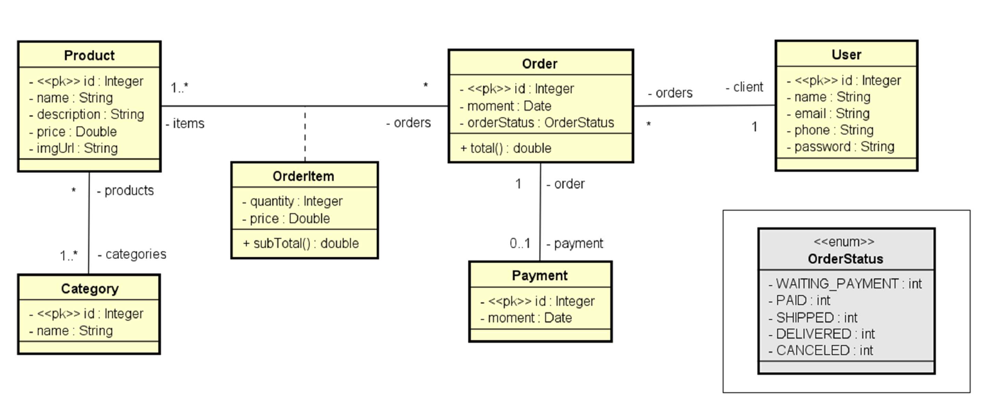
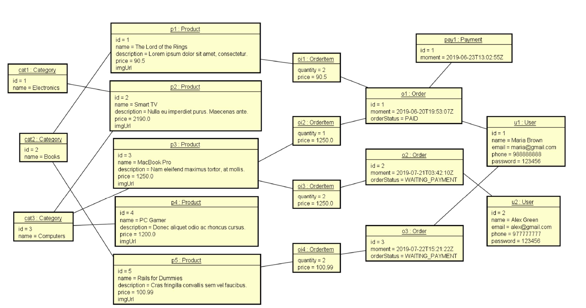

# spring-boot-course
Spring Boot project with jpa.

# Projeto Web Services com Spring Boot e JPA / Hibernate
 

# Sobre o projeto

Este projeto foi desenvolvido no curso de Java Completo que tem como proposta implmentar uma API Rest para gerenciar Usuários, Pedidos, Produtos e Pagamentos. Indo além do conteúdo do curso implementei a API para gerenciar Produtos, métodos POST, PUT e DELETE, foi implementado o Swagger e testes unitários com JUnit.

A API pode ser acessada via localhost: http://localhost:8080/swagger-ui/index.html

# Domain Model



# Domain Instace



# User Entity:

### GET (/users)
Este método retorna um array de pessoas cadastradas no formato json.

### GET (/users/{id})
Este método retorna o usuário correspondente, se existir.

### POST (/users)
Este método retorna o objeto json criado, deve-se inserir uma requestBody.
Exemplo:
```
{
    "name":"Usuario",
    "email": "usuario@email.com",
    "phone": "9876543210",
    "password": "0123456"
}
```
### PUT (/pessoa/{id})
Este método retorna o objeto atualizado, deve-se inserir uma requestBody.
Exemplo:
```
{
    "name":"Usuario",
    "email": "usuario@email.com",
    "phone": "9876543210",
    "password": "0123456"
}
```
### DELETE (/pessoa/{id})
Este metodo deleta da base de dados o registro correspondente ao id informado no endipoint, caso ele exista.

# Entity Category:

### GET (/categories)
Este metodo retorna um array de todas as categorias presentes no banco de dados.
Exemplo:
```
[
    {
        "id": 1,
        "name": "Electronics"
    }
]
```
### GET (/categories/{id})
Este metodo retorna a categoria correspondente ao id informado no endpoint.
Exemplo:
```
    {
        "id": 1,
        "name": "Electronics"
    }
```

# Entity Order:

### GET(/orders)
Este medoto retorna um array de todos os Orders cadastrados no banco de dados.
Nesta lista de objetos temos a informação de quem comprou, os itens do pedido, status do pagamento e total.
Exemplo:
``` 
[
    {
        "id": 2,
        "moment": "2019-07-21T03:42:10Z",
        "orderStatus": "WAITING_PAYMENT",
        "client": {
            "id": 2,
            "name": "Alex Green",
            "email": "alex@gmail.com",
            "phone": "977777777",
            "password": "123456"
        },
        "items": [
            {
                "quantity": 2,
                "price": 1250.0,
                "subTotal": 2500.0,
                "product": {
                    "id": 3,
                    "name": "Macbook Pro",
                    "descrption": "Nam eleifend maximus tortor, at mollis.",
                    "price": 1250.0,
                    "imgUrl": "",
                    "categories": [
                        {
                            "id": 3,
                            "name": "Computers"
                        }
                    ]
                }
            }
        ],
        "payment": null,
        "total": 2500.0
    }
]
```
### GET(/orders/{id})
Este metodo retorna o Order correspondente ao id informado no endpoint, se existir.
Neste objeto temos a informação de quem comprou, os itens do pedido, status do pagamento e total.
Exemplo:
``` 
{
    "id": 2,
    "moment": "2019-07-21T03:42:10Z",
    "orderStatus": "WAITING_PAYMENT",
    "client": {
        "id": 2,
        "name": "Alex Green",
        "email": "alex@gmail.com",
        "phone": "977777777",
        "password": "123456"
    },
    "items": [
        {
            "quantity": 2,
            "price": 1250.0,
            "subTotal": 2500.0,
            "product": {
                "id": 3,
                "name": "Macbook Pro",
                "descrption": "Nam eleifend maximus tortor, at mollis.",
                "price": 1250.0,
                "imgUrl": "",
                "categories": [
                    {
                        "id": 3,
                        "name": "Computers"
                    }
                ]
            }
        }
    ],
    "payment": null,
    "total": 2500.0
}
```

# Entity Product:

### GET(/products)
Este metodo retorna um array de Produtos cadastrados no banco de dados.
Exemplo:
```
[ 
    {
        "id": 3,
        "name": "Macbook Pro",
        "descrption": "Nam eleifend maximus tortor, at mollis.",
        "price": 1250.0,
        "imgUrl": "",
        "categories": [
            {
                "id": 3,
                "name": "Computers"
            }
        ]
    }
]
```
### GET(/products/{id})
Este metodo retorna o Produto correspondente ao id informado no endpoint, se existir.

### POST(/products)
Este metodo salva um novo produto no banco de dados.
Exemplo:
```
{
    "name": "Novo Produto com duas CAT",
    "descrption": "Teste de insercao de Novo produto duas CAT",
    "price": 3000.0,
    "imgUrl": "",
    "categories": [
        {
            "id": 4
        },
        {
            "id": 5
        }
    ]
}
```

# Tecnologias utilizadas
- Java 17
- Maven
- Spring
- STS
- H2 DataBase - Tests
- MySQL
- Postman


# Autor

Marcello Joaquim da Silva

linkedin.com/in/marcello-joaquim-da-silva-6814bb69